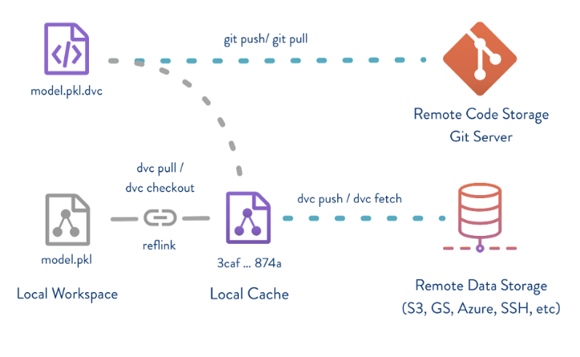

# Data Management (data version control)

## Intro
### 1. Data version control의 필요성
ML개발을 하다보면 Raw data를 조금씩 변경시켜 가면서 즉, feature engineering을 해보면서 
Data 의 version이 생겨나게 된다. 
> 내가 연구실에서 연구할 때만 해도 resolution도 변경시켜보고, generalize도 해보고 .. 하면서 데이터 자체를 건들이는 일이 많았다. 

ex. 시계열 데이터에서 noise를 줄이면서 데이터의 대표성을 잃지 않기 위해 위해 일정 기간동안의 average를 적용하는 일이 많음.    
이 때 '일정 기간'을 여러 시도해보면서 가장 좋은 성능을 내는 데이터가 무엇이고, 가장 좋은 성능을 내는 Feature engineering 기법은 무엇인지 version마다 관리하는 것이 필요해짐.    


### 2. Data Management Tool란
Data version마다 '최종', '최종최종', '이게 진짜 좋음' 이렇게 파일명으로 개발할 것인가?!    
software engineering에서 Git을 사용하는 이유는 분명 있다. 
그리고 Git 을 hosting해주는 Github 같은 platform 서비스는 사용을 훨씬 편리하게 해준다. 
하지만 이런 software source code(text file)을 위한 platform 서비스는 '대용량' 데이터를 올리기에는 한계가 있다. 
> 실제 내가 회사에서 실제 AI 분석을 돌리지 않아도 되는 dummy ai analyzer를 개발하기 위해 미리 분석결과를 file로 저장하기에도 git lfs Free model로는 한계가 있고, 특히 image, 영상 data는 더욱이 어려워진다.    
이에 대해 S3 사용을 고려하기도 한다.  

이런 측면에서 Data Management 에 용이한 Tool에도 대표적으로 `DVC`, `Pachyderm`, `Delta Lake`, `Dolt`등이 있다. 


### 3. [DVC](https://dvc.org/)
이 중에서 
- opensource이며
- 사용법이 git과 비슷해서 사용이 쉬워서
DVC를 사용하고 
-> 데이터 관리와
-> git과의 연동에 대해 알아보고자 한다. 

특징으로는
- 대부분의 S3, google drive..등의 storage와 호환된다. 
- Github외의 GitLab, Bitbucket등의 대부분의 git 호스팅 서버와 연동됨
- Data Pipeline을 재현가능하도록 DAG로 관리
- Git과 유사한 인터페이스

DVC 구조
1. 실제 data는 storage에 저장되고, 
2. Github repo에는 그 data의 metadata만 저장된다. 
이 1, 2를 쉽게 사용할 수 잇도록 자동화되어있음. 


---


## Install dvc
### prerequisite
- **가상환경** setting
```bash
python3 -m venv venv && source ./venv/bin/activate            
````

- **python** 설치

```bash
python -V
# Python 3.9.6
```

- **git** 설치
```bash
sudo apt install git

git --version
# git version 2.25.1

git --help
# 정상 설치되었는지 확인
```

### DVC 설치

```bash
# dvc[all] 에서 [all] 은 dvc 의 remote storage 로 s3, gs, azure, oss, ssh 모두를 사용할 수 있도록 관련 패키지를 함께 설치하는 옵션입니다.
pip install 'dvc[all]==2.6.4'

# 정상 설치되었는지 확인
dvc --version

dvc --help


# 현재 directory(.mlops-practice)를 dvc 저장소로 초기화 한다. 
dvc init
```

### DVC 저장소 세팅
1) 새 Directory 를 생성합니다.

```bash
# STEP 1) 새로운 directory 를 만들고 이동합니다.
mkdir data-management/data

cd data-management/data
```

2) 해당 Directory 를 git 저장소로 초기화합니다.

```bash
# STEP 2) git 저장소로 초기화합니다.
git init
```

3) 해당 Directory 를 dvc 저장소로 초기화합니다.
---

## DVC 기본 명령 1

### 1) dvc 로 버전 tracking 할 data 를 생성합니다.

```bash
# data 를 저장할 용도로 data 라는 이름의 디렉토리를 생성하고 이동합니다.
mkdir data-management/data

cd data-management/data

# 가볍게 변경할 수 있는 데이터를 카피해오거나, 새로 만듭니다.
cat sample_data.csv 
# 연도,제조사,모델,설명,가격
# 1997,Ford,E350,"ac, abs, moon",3000.00
# 1999,Chevy,"Venture ""Extended Edition""","",4900.00
# 1999,Chevy,"Venture ""Extended Edition, Very Large""",,5000.00
```

### 2) 방금 생성한 데이터를 dvc 로 tracking 합니다.

```bash
cd ..

dvc add data-management/data/sample_data.csv

# To track the changes with git, run:
git add data-management/data/sample_data.csv.dvc data-management/data/.gitignore
```

### 3) dvc add 에 의해 자동 생성된 파일들을 확인합니다.

```bash
cd data-management/data
ls
# sample_data.csv.dvc 파일이 dvc add data-management/data/sample_data.csv 명령으로 인해 자동 생성된 것을 확인

cat sample_data.csv.dvc
# sample_data.csv 파일의 메타정보를 가진 파일입니다.
# git 에서는 sample_data.csv 파일이 아닌, sample_data.csv의 메타정보가 있는 sample_data.csv.dvc 파일만 관리하게 됩니다.
```

### 4) git commit 을 수행합니다.

```bash
git commit -m "Add sample_data.csv.dvc"
```

- (`.dvc` 파일은 `git push` 를 수행하여, git repository 에 저장합니다.)

### 5) data 가 실제로 저장될 remote storage 를 세팅합니다.

- 본인의 google drive 에 새로운 폴더를 하나 생성해준 뒤, url 로부터 ID 를 복사합니다.

```bash
dvc remote add -d storage gdrive://<GOOGLE_DRIVE_FOLDER_ID>
# dvc 의 default remote storage 로 gdrive://<GOOGLE_DRIVE_FOLDER_ID> 를 세팅합니다.
```

### 6) 이 변경 사항을 git에서 관리할 수 있도록 dvc config 를 git commit 합니다.

```bash
git add .dvc/config
git commit -m "add remote storage"
```

### 7) dvc push

- 데이터를 remote storage 에 업로드합니다.

```bash
dvc push

#Go to the following link in your browser:
#
#    https://accounts.google.com/o/oauth2/.........
#
# Enter verification code:
```

- dvc push 를 수행하기 위해서는 인증 과정이 필요합니다.
    - 위의 주소로 이동하여, google login 을 통해 인증을 수행해주시기 바랍니다.
        
- 구글 드라이브로 이동하여 파일이 정상적으로 업로드되었는지 확인합니다.
    - 새로운 폴더가 하나 생성되었고, 폴더 내부에 긴 이름의 파일이 하나 업로드된 것을 확인하실 수 있습니다.
    - 이 파일을 다운로드받은 뒤 열어보면 업로드한 파일과 동일한 파일임을 확인할 수 있습니다.

---

## DVC 기본 명령 2

### 1) dvc pull

- 데이터를 remote storage 로부터 다운로드합니다.

```bash
cd dvc-tutorial

# dvc 캐시를 삭제합니다.
rm -rf .dvc/cache/
# dvc push 했던 데이터를 삭제합니다.
rm -rf data-management/data/sample_data.csv

# dvc pull 로 google drive 에 업로드했던 데이터를 다운받습니다.
dvc pull

# 방금 다시 다운받은 데이터가 이전 데이터와 동일한지 확인합니다.
cat data-management/data/sample_data.csv
```

### 2) dvc checkout

- data 의 버전 변경하는 명령어입니다.
- 버전 변경 테스트를 위해, 새로운 버전의 data 를 dvc push 합니다.

```bash
# 데이터를 변경합니다. (새로운 데이터를 같은 이름으로 copy 해와도 좋습니다.)
vi data-management/data/sample_data.csv

# 변경되었는지 확인합니다.
cat data-management/data/sample_data.csv

# dvc add (data-management/data/sample_data.csv.dvc 를 변경시켜주는 역할)
dvc add data-management/data/sample_data.csv

# git add and commit
git add data-management/data/sample_data.csv.dvc
git commit -m "update sample_data.csv"

# dvc push (and git push)
dvc push # 새로운 버전의 data 파일을 remote storage 에 업로드

(git push) # .dvc 파일을 git repository 에 업로드

```

- 구글 드라이브로 이동하여 new 파일이 정상적으로 업로드되었는지 확인합니다.
    - 새로운 폴더가 추가로 생성되었고, 폴더 내부에 긴 이름의 파일이 하나 업로드된 것을 확인하실 수 있습니다.
    - 이 파일을 다운로드받은 뒤 열어보면 방금 변경한 파일이 업로드 된 것을 확인할 수 있습니다.
- 이전 버전의 data 로 되돌아가보겠습니다.

```bash
# git log 를 확인합니다.
git log --oneline

# sample_data.csv.dvc 파일을 이전 commit 버전으로 되돌립니다.
git checkout <COMMIT_HASH> data-management/data/sample_data.csv.dvc

# dvc checkout 합니다. (sample_data.csv.dvc 의 내용을 보고 sample_data.csv 파일을 이전 버전으로 변경합니다.)
dvc checkout

# 데이터가 변경되었는지 확인합니다.
cat data-management/data/sample_data.csv
```

---

## DVC 의 추가 기능

- 이번 강의에서 다루지 않은 DVC 의 추가 기능
    - Python API 를 사용한 제어
        - [https://dvc.org/doc/api-reference](https://dvc.org/doc/api-reference)
    - S3, HDFS, SSH 등의 remote storage 연동
    - DAG 를 통한 Data pipeline 관리
        - [https://dvc.org/doc/start/data-pipelines](https://dvc.org/doc/start/data-pipelines)
    - `dvc metrics`, `dvc plots` 를 사용한 각 실험의 metrics 기록 및 시각화