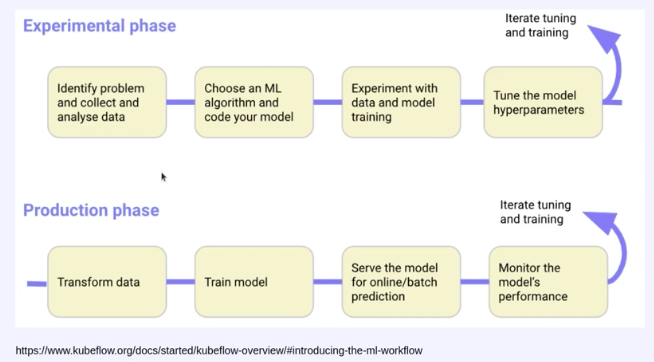

# Kubeflow for Automation & Model research

## Kubernetes가 MLOps에 필요한 이유 - container기반의 ochestration이 핵심. 
1. Reproducibility -> 실행 환경의 일관성 & 독립성
2. Job Schedulilng -> 스케줄 관리, 병렬 작업 관리, 유휴 자원 관리
3. Auto-healing & Auto-scaling -> 장애 대응, 트래픽 대응

> 여러 현업 예시가 있지만 가장 impact 있게 다가왔고, 실제로 현업에서도 해당 기능이 고려되고 있는 것은 다음과 같은 기능이다. 
AI 분석 기능에서 사실 실제로 비용이 비싼 GPU를 사용하는 부분은 
- training 단계와 
- Inference 단계 중에서도 실제 '예측'이 들어가는 단계이다. 
다시 말해, 실제 예측 전 pre-processing이나 post-processing에는 GPU가 필요하지 않다. 

따라서 필요할 '때만' GPU를 핡당 받아서 사용하고, 그렇지 않을 때는 반납하는 형식으로 사용하면 리소스를 매우 효율적으로 사용할 수 있다. 


## Kubeflow의 필요성
- kubernetes는 진입장벽이 높은 기술임
- 그래서 kubernetes에 익숙하지 않은 ML Engineer가 합습이나 서빙을 kubernetes로 쉽게 할 수 있도록 구글이 개발함. 


## Kubeflow 구성 요소
### ml-workflow


### Central Dashboard
: web brawser에서 각각의 kubeflow MSA에 접속 할 수 있는 통합 dashboard. 
(ex.AWS로 치면 console 과 비슷한 거 같음)

### Notebook Server
jupyter notebook도 kubernetes 위에서 kubernetes native하게 사용할 수 있도록 제공하는 서비스 
(ex. jupyter lab과 비슷)
그래서 그냥 local에서 띄운거랑 뭐가 다르냐?! -> kubernetes resources관리 하에 있기 때문에 예를 들어 지금 cluster의 GPU 리소스가 부족하니 notebook 추가 생성이 pending되고 있다. 는 정보를 제공해준다. 

그리고 주의 할 것은
notebook server도 어찌되었건 kubernetes의 pod중 하나이기 때문에 stateless. 즉, 컨테이너 내부에서 작업한 내용을 보존해주지는 않음. (pvc mount 기능을 사용하면 되긴 함. )

### Pipelines
- 가장 main logic을 담당하는 매우 중요한 서비스. 
- MLOps platform을 만드는 사람(개발팀)과 MLOps platform을 사용하는 사람(연구팀)이 있는데, 연구팀은 거의 kubeflow의 pipelines 기능을 많이 사용하게 될 것임. 
- 머신러닝 workflow를 DAG(비순환 그래프) 형태로 정의한 것
- kubeflow에 배포 후 run 하면 pipeline을 구성하는 각각의 component들이 kubernetes위에서 pod으로 생성되어 서로 데이터를 주고받으며 흘러감
- 즉, model을 serving까지 보내는 데 필요한 모든 작업을 재사용 가능한 단위(component)로 나누고, kuberentes위에서 연결시켜주는 역할
-  Pipeline의 Goal
    1. 모델 연구 및 학습 과정과 서빙 과정의 괴리가 없도록
    2. 다양한 configuration에 따라 수많은 시도를 쉽게
    3. 잘 설계된 kfp component들은 재사용 가능하므로, 새로 pipeline을 만들 때의 작업 효율 향상. 
- pipeline 구현 방법
    - 개발자가 python SDK를 사용해서 pipeline을 작성하면, 이는 kubernetes가 이해할 수 있는 yaml 파일로 compile  시켜준다. 

- pipeline 실행 방법
    1. UI
    2. CLI
    3. Rest api
    4. Python SDK

### KFServing
Kubernetes위에서 ML model serving 을 담당함. 

## 실습
kubeflow를 minikube환경에 설치해서 

### 1. Prerequisite 개념

- kustomize
    - Helm 과 비슷한 역할을 담당
        - 여러 개의 yaml 파일들을 쉽게 관리하기 위한 도구
    - 여러 resource 들의 configuration 을 템플릿(**base**)과 커스터마이제이션한 부분(**overlay**)을 나누어서 관리할 수 있는 도구
    - `kustomize build` 명령을 통해, base + overlay 가 merge 된 형태의 yaml 파일들을 generate 할 수 있음

---

### 2. kubectl 설치 방법

- Kfctl
    - v1.2 이후로는 공식적으로 지원하지 않음
- Minikf
    - 아직 v1.3 까지만 릴리즈
    - kubeflow 가 이미 설치되어있는 VM 이미지를 사용하여 Vagrant 쉽게 설치 가능
- **Kubeflow manifests**
    - **공식** 릴리즈 관리용 [Repository](https://github.com/kubeflow/manifests)
    - Kustomize v3 기반으로 manifests 파일 관리
    - 가장 정석적인 방법

---

### 3. Kubeflow 설치

#### Prerequisite

- Kubernetes 환경
    - 버전 : v1.17 ~ v1.21
        - v1.19.3 사용
    - Default StorageClass
        - Dynamic provisioning 지원하는 storageclass
    - TokenRequest API 활성화
        - alpha version 의 API 이므로, k8s APIServer 에 해당 feature gate 를 설정해주어야 함
- Kustomize
    - 버전 : v3.x
        - v3.2.0 사용

```bash
(venv) hyeonjeongchung@jeonghyeonjeongs-MacBook-Air mlops-practice % kubectl version --short
Flag --short has been deprecated, and will be removed in the future. The --short output will become the default.
Client Version: v1.25.2
Kustomize Version: v4.5.7
```
---

### Step 1) kustomize 설정

```bash
# 바이너리 다운 (for linux amd64)
# 이외의 os 는 https://github.com/kubernetes-sigs/kustomize/releases/tag/v3.2.0 경로에서 binary 링크 확인
wget https://github.com/kubernetes-sigs/kustomize/releases/download/v3.2.0/kustomize_3.2.0_linux_amd64

# For MAC, 
brew install kustomize

# file mode 변경
chmod +x kustomize_3.2.0_linux_amd64

# file 위치 변경
sudo mv kustomize_3.2.0_linux_amd64 /usr/local/bin/kustomize

# 버전 확인
kustomize version
# v5.0.1
```

### Step 2) minikube start

minikube 설치 for MAC
brew install minikube

```bash
# minikube start
# docker driver option
# cpu 4 개 할당
# memory 7g 할당
# kubernetes version v.19.3 설정
# --extra-config 부분은 tokenRequest 활성화 관련 설정
minikube start --driver=docker \
  --cpus='4' --memory='7g' \
  --kubernetes-version=v1.19.3 \
  --extra-config=apiserver.service-account-signing-key-file=/var/lib/minikube/certs/sa.key \
  --extra-config=apiserver.service-account-issuer=kubernetes.default.svc
```

- 다음과 같이 default-storageclass 는 기본으로 addon 이 활성화되어있음
    
    ```bash
    🔎  Kubernetes 구성 요소를 확인...
        ▪ Using image gcr.io/k8s-minikube/storage-provisioner:v5
    🌟  애드온 활성화 : storage-provisioner, default-storageclass
    ```
    

### Step 3) Git clone kubeflow/manifests

- kubeflow/manifests Repository 를 로컬 폴더에 git clone 합니다.
    - [https://github.com/kubeflow/manifests](https://github.com/kubeflow/manifests)
    
    ```bash
    cd mlops-practice/kubeflow

    # git clone
    git clone git@github.com:kubeflow/manifests.git
    
    # 해당 폴더로 이동
    cd manifests
    
    # v1.4.0 태그 시점으로 git checkout
    git checkout tags/v1.4.0
    ```
    

### Step 4) 각각의 kubeflow 구성 요소 순서대로 설치

> 이번 실습에서 사용하지 않는 일부 구성요소는 설치를 진행하지 않습니다.
> 
> - Knative, KFServing, Training Operator, MPI Operator

[GitHub - kubeflow/manifests at v1.4.0](https://github.com/kubeflow/manifests/tree/v1.4.0) -> 여기서 README의 installation을 잘 읽어보기. 

그리고 <[Install individual components](https://github.com/kubeflow/manifests/tree/v1.4.0#install-individual-components)> 를 통해 필요한 것을 하나씩 설치해보도록 함. 

- kustomize build 의 동작 확인해보기
    - `kustomize build common/cert-manager/cert-manager/base`
    - `|` pipe 연산자를 활용하여, kustomize build 의 결과물을 kubectl apply -f - 하여 적용
    - `kustomize build common/cert-manager/cert-manager/base | kubectl apply -f -`

    1. cert-manager

    2. Istio: Istio is used by many Kubeflow components to secure their traffic, enforce network authorization and implement routing policies.

    3. Dex: Dex is an OpenID Connect Identity (OIDC) with multiple authentication backends. In this default installation, it includes a static user with email user@example.com. By default, the user's password is 12341234. For any production Kubeflow deployment, you should change the default password by following the relevant section.
    
    4. OIDC AuthService: The OIDC AuthService extends your Istio Ingress-Gateway capabilities, to be able to function as an OIDC client: `kustomize build common/oidc-authservice/base | kubectl apply -f -`

    5. Kubeflow Namespace: Create the namespace where the Kubeflow components will live in. This namespace is named kubeflow.
    Install kubeflow namespace:`kustomize build common/kubeflow-namespace/base | kubectl apply -f -`

    6. Kubeflow Roles: Create the Kubeflow ClusterRoles, kubeflow-view, kubeflow-edit and kubeflow-admin. Kubeflow components aggregate permissions to these ClusterRoles.
    Install kubeflow roles:`kustomize build common/kubeflow-roles/base | kubectl apply -f -`

    7. Kubeflow Istio Resources: Create the Istio resources needed by Kubeflow. This kustomization currently creates an Istio Gateway named kubeflow-gateway, in namespace kubeflow. If you want to install with your own Istio, then you need this kustomization as well.
    
    8. Katib

    9. Central Dashboard

    10. Admission Webhook

    11. Notebooks

- 모든 구성요소가 Running 이 될 때까지 대기
    - `kubectl get po -n kubeflow -w`
        - 상당히 많은 구성요소들의 docker image 를 로컬 머신에 pull 받기 때문에, **최초 실행 시에는 네트워크 상황에 따라 약 30 분 정도까지도 소요될 수 있음**
    - 여러 구성요소들의 상태가 `PodInitializing` → `ContainerCreating` 으로 진행되지만 시간이 오래걸리는 경우라면 정상적인 상황이지만, 상태가 `Error` or `CrashLoopBackOff` 라면 minikube start 시의 설정을 다시 확인해주시기 바랍니다.

---

### 4. Kubeflow 접속

- 포트 포워딩
    - `kubectl port-forward svc/istio-ingressgateway -n istio-system 8080:80`
    - gateway 를 포트포워딩하여 [localhost:8080](http://localhost:8080) 으로 kubeflow 대시보드에 접속
- 접속 정보
    - kubeflow manifests 배포 시, user 접속 정보 관련 설정을 변경하지 않은 경우의 default 접속 정보
        - ID : [user@example.com](mailto:user@example.com)
        - PW : 12341234

---

### 5. Other Useful Tool

- kubectx & kubens
    - kubectx란? 다중클러스터 사용시 클러스터 전환을 쉽게 해주는 툴
    - kubens란? k8s cluster 내에 namespace를 쉽게 전환해주는 툴
    - 설치 brew install kubectx
    - [https://github.com/ahmetb/kubectx](https://github.com/ahmetb/kubectx)
        - Install 방법도 매우 간편
    - kubernetes 의 current-context 와, kubernetes 의 current-namespace 를 변경할 수 있는 툴
        - 여러 개의 context 나 namespace 를 다루는 경우에 유용하게 사용할 수 있음
    - ex)
        - `kubens kubeflow` 를 수행하면 현재 바라보고 있는 namespace 가 kubeflow 로 변경됨
- kubectl-alias
    - [https://github.com/ahmetb/kubectl-aliases](https://github.com/ahmetb/kubectl-aliases)
    - kubectl 관련 여러 명령어에 대한 alias 를 자동 생성
        - 자주 사용하는 명령을 쉽게 수행할 수 있음
    - ex)
        - `kubectl get pod` → `kgpo`
        - `kubectl get deployment -w` → `kgdepw`
