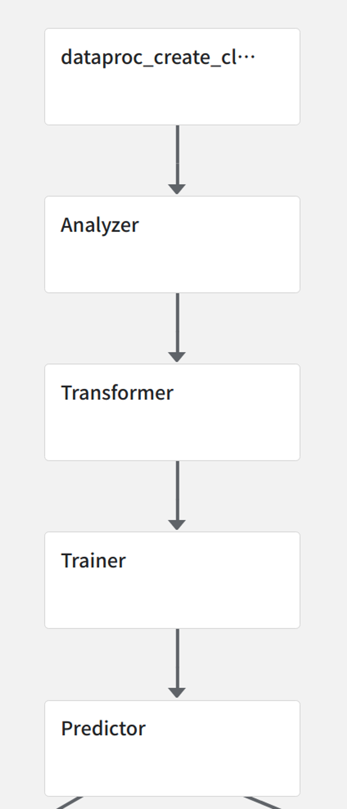
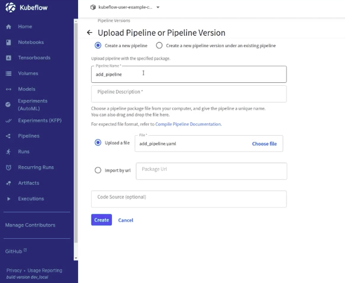
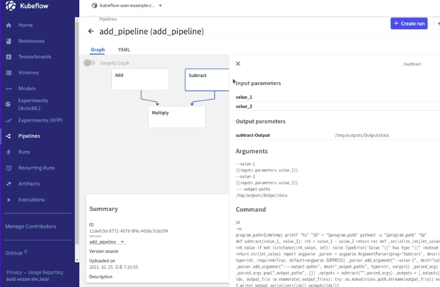
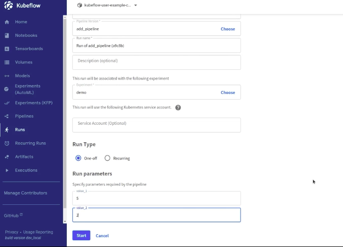

# Kubeflow 실습 1  - python code로 pipeline 생성해서 central board에서 확인해보기
# 1. Prerequisite

### 환경 세팅

- python 가상환경
    - 3.8.9
- pypi 패키지
    - kfp
        - `pip install kfp --upgrade --use-feature=2020-resolver`
            
            ```bash
            kfp                      1.8.6
            kfp-pipeline-spec        0.1.13
            kfp-server-api           1.7.0
            ```
            
        - 정상 설치 확인
            - `kfp --help`
            - `which dsl-compile`
- 이전 시간에 설치한 minikube with kubeflow 환경

---

### 개념

- Pipeline 과 Component 의 관계
    - Component : 재사용 가능한 형태로 분리된 하나의 작업 단위
    - Pipeline : 여러 Component 들의 연관성, 순서에 따라 연결지은 그래프(DAG)
        
        
        
- 쿠버네티스 관점에서는 다음과 같은 리소스에 매핑
    - Pipeline : Workflow 
    - Component : Pod
- **Pipeline**
    - **(중요) kfp sdk 를 사용하여 python code로 pipeline 을 구현한 뒤, kfp 의 dsl compiler 즉, `dsl-compile` 혹은 `kfp.compiler.Compiler().compile()` 명령을 사용해 컴파일하면 k8s 가 이해할 수 있는 형태의 yaml 파일이 생성됩니다.** 
        
        - yaml 파일을 조금 자세히 살펴보면, `kind` 가 **Workflow** 로 되어있는 것을 확인할 수 있으며, 여러분이 작성한 component code 들이 중간중간에 copy 되어있는 것을 확인하실 수 있습니다.
            - **추후 실습 시 함께 살펴볼 예정입니다.**
        - **Workflow** 라는 리소스는 간단히 말하면 여러 개의 container 들을 정해진 순서에 따라 실행시키고, input/output 을 전달하는 것을 정의한 **DAG** 입니다.
            - Workflow 는 k8s 의 기본 리소스는 아니지만, kubeflow 설치 시 함께 설치된 여러 모듈 중, argoproj 의 Workflow-controller 에 의해 관리되는 CR(Custom Resource) 입니다.
- **Component**
    - kfp sdk 를 사용하여 component 를 구현하면, 그 component 를 사용하는 pipeline 을 컴파일했을 때 생성되는 workflow yaml 파일의 `spec.templates` 에 해당 컴포넌트를 감싼 (containerized) 부분이 추가됩니다.
        - **하나의 component 는 k8s 상에서는 하나의 독립적인 pod 으로 생성**되어 **component 내부에 작성된 코드**를 component decorator 에 작성한 **base_image 환경**에서 실행하게 됩니다.
            - **base_image 지정을 통해** 항상 동일한 환경에서 정해진 코드가 실행되는 것을 보장할 수 있습니다.
        - 따라서 하나의 pipeline 내에서 연속된 component 라고 하더라도 **memory 를 공유하는 일은 일어나지 않으며 (앞에서 적힌 글을 또 적자면, 이 compoenent는 독립적이고 꼈다 뺐다, 어디서든 재현 가능 해야하므로)**, 일반적으로 서로 다른 component 간의 data 공유는 input/output 변수 혹은 파일경로로 넘겨주는 방식을 사용합니다.
            - (pvc 를 공유하는 방식을 사용할 수도 있습니다.)

---

# 2. Quick Start with add example

> 간단한 python code 를 component 와 pipeline 으로 만들어 본 뒤, kubeflow 에 배포하여 사용(run)해봅니다.
> 
- 먼저 간단한 kubeflow pipeline 을 만드는 example code 를 함께 보며, python code 로 kubeflow pipeline 을 만드는 방법을 살펴봅니다.
    - 해당 예시 코드:  see ./pipeline.py
    - `from kfp.components import create_component_from_func`, `from kfp.dsl import pipeline` 가 핵심!
    
- pipeline 을 compile 한 뒤, 생성되는 add_pipeline.yaml 을 간단하게 살펴보겠습니다.
    - 단, 해당 python code 의 주석에 한글이 들어가면 encoding 문제로 pipeline upload 가 되지 않을 수 있으니, 컴파일 전에는 한글 주석을 모두 제거해주시기 바랍니다.
    - `dsl-compile --py pipeline.py --output add_pipeline.yaml`

- port forwarding
```bash
    # port-forwarding
    kubectl get svc -n istio-system

    kubectl port-forward svc/istio-ingressgateway -n istio-system 8080
 ```

- localhost:8080 에서 central board에 들어가서 > Pipelines > Upload pipeline 에서
 `add-pipeline.yaml` 을 kubeflow 에 업로드하고 run 해본 뒤, 결과를 함께 확인해보겠습니다.
    - graph 를 확인해보고, run 하여 input, output 이 어떻게 넘겨지는지, 최종 output 과 log 는 어떻게 확인할 수 있는지 함께 확인해보겠습니다.

    
    
    

---

# 3. Python 을 사용하여 pipeline 을 만드는 순서 정리

> 앞서 Quick Start 를 통해 pipeline 을 만들었던 순서를 정리해보고, 앞으로 pipeline 을 만들 때마다 참고하도록 합니다.
> 
1. Python 함수를 구현합니다.
    1. 해당 함수 밖에서 선언된 코드를 사용해서는 안 됩니다.
        1. import 문까지도 함수 안에 작성되어야 합니다.
    2. **단,** 해당 python 함수를 component 로 만들 때, **base_image** 로 사용하는 **Docker 이미지**에 들어있는 코드는 함수 내부에 선언하지 않아도 사용할 수 있습니다.
        1. **복잡한 로직**을 모두 Python 함수 단위로 모듈화를 하기는 어렵기 때문에, 이런 경우에는 Component 의 base image 로 사용할 docker image 를 만들어두고 base_image 로 지정하는 방식을 **주로 사용**합니다.
        2. 자세한 사용 방법은 다음 [링크](https://www.kubeflow.org/docs/components/pipelines/sdk/python-function-components/#containers)를 참고합니다.
    3. pipeline 으로 엮을 수 있도록 input, output 을 잘 지정하여 구현합니다.
        1. component 간에 input, output 을 넘기는 방식은 추후 다른 예제로 함께 살펴보겠습니다.
2. `[kfp.components.create_component_from_func](https://kubeflow-pipelines.readthedocs.io/en/latest/source/kfp.components.html#kfp.components.create_component_from_func)` 함수를 사용하여, Python 함수를 kubeflow Component (ContainerOp) 로 변환합니다.
    1. decorator 로 사용할 수도 있고, base_image, extar_packages 등 여러 argument 를 지정할 수도 있습니다.
3. `kfp.dsl.pipeline` 데코레이터 함수를 사용하여, 각 component 들간의 input-output 을 엮습니다.
    1. kfp.dsl 의 여러 메소드들을 사용하여, 컴포넌트 실행 시의 Condition 등을 지정할 수도 있습니다. 이는 추후 다른 예제로 함께 살펴보겠습니다.
4. `kfp.compiler.Compiler().compile` 혹은 `dsl-compile` 을 사용하여 pipeline python code 를 k8s 의 Workflow yaml 파일로 컴파일합니다.
5. 컴파일된 yaml 파일을 UI 를 통해 업로드하고 run 합니다. 혹은 `kfp.Client` 를 사용하거나 kfp CLI, HTTP API 를 사용해서 run 할 수도 있습니다.

---

# 4. Kfp Compiler 사용법

- Example pipeline.py 코드에 kfp.compiler를 함수 내에서 사용해서 실행하는 코드로 수정. 
    
    ```python
    import kfp.compiler
    from kfp.components import create_component_from_func
    
    def add(value_1: int, value_2: int) -> int:
        """
        더하기
        """
        ret = value_1 + value_2
        return ret
    
    def subtract(value_1: int, value_2: int) -> int:
        """
        빼기
        """
        ret = value_1 - value_2
        return ret
    
    def multiply(value_1: int, value_2: int) -> int:
        """
        곱하기
        """
        ret = value_1 * value_2
        return ret
    
    add_op = create_component_from_func(add)
    subtract_op = create_component_from_func(subtract)
    multiply_op = create_component_from_func(multiply)
    
    from kfp.dsl import pipeline
    
    @pipeline(name="add example")
    def my_pipeline(value_1: int, value_2: int):
        task_1 = add_op(value_1, value_2)
        task_2 = subtract_op(value_1, value_2)
    
        task_3 = multiply_op(task_1.output, task_2.output)
    
    if __name__ == "__main__":
        kfp.compiler.Compiler().compile(my_pipeline, "./add_pipeline_2.yaml")
    ```
    
- 위의 add example pipeline 과 동일한 코드이지만, compile 할 때, `dsl-compile` 대신, `kfp.compiler` 를 사용하는 코드가 추가된 버전입니다.
    - `python add_2.py` 를 실행시키면 `add_pipeline_2.yaml` 이 정상적으로 생성되는 것을 확인할 수 있습니다.