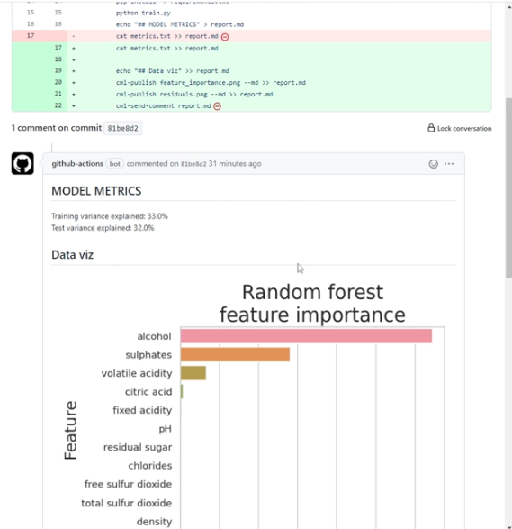

# Model CICD pipeline

## Github Actions와 CML 과 DVC 연계를 통한 Model Metric Tracking
실습 목표
1. Github Actions 를 활용하여 예제 머신러닝 코드 실행하여 성능 지표 출력하기
2. CML 을 사용하여 성능 지표를 레포트 형태로 출력하기
3. 분석 코드 변경 후 재배포 시 레포트 재생성 하기
4. DVC 를 활용하여 Metric 의 변화 추적하기

- Github Actions: 개발자의 workflow를 자동화 시키기 위한 platform (주의. CICD tool 이 아님. CICD도 workflow 중 하나일 뿐임.)
- [CML](https://github.com/iterative/cml) : 데이터 사이언스 프로젝트를 지속적으로 통합시키기 위한 오픈소스
- [DVC](https://dvc.org/): Data management tool이며 이것에 대한 자세한 내용은 ./data-management/README.md 에 적어둔 바 있다. 

### Let's run in local env
```bash
python3 -m venv venv && source ./venv/bin/activate

pip install -r requirements.txt

python3 train.py

# after train is done, check output files feature_importance.png, residuals.png, metrics.txt(성능지표). 
```


### CML 을 사용하여 성능 지표를 레포트 형태로 출력하기
Github Actions에서 실행되어서 출력된 결과를 Github Actions console page에 들어가지 않고 레포트 형식으로 출력된 것을 볼 수 있도록 CML을 사용해보자. 

- [CML Functions](https://github.com/iterative/cml#cml-functions)에 활용법이 잘 나와 있음. 
- sample code: ./model-train-cml-tracking
- data: Modelling a Kaggle dataset of [red wine properties and quality ratings](https://www.kaggle.com/datasets/uciml/red-wine-quality-cortez-et-al-2009).
- github actions yml: $(root)/.github/workflows/model-training.yml
- Github actions 실행 결과



### DVC CML 연계를 통한 Model Metric Tracking
DVC로 서로 다른 version의 model metric tracking을 편리하게 할 수 있을지 알아보자. 
- sample code: ./dvc-cml-model-metric-tracking
- data: Modeling Swiss farmer's attitudes about climate change. Modeling data from [Kreft et al. 2020](https://www.sciencedirect.com/science/article/pii/S2352340920303048).
- github actions yml: $(root)/.github/workflows/dvc-model-training.yml

```bash
python3 -m venv venv && source ./venv/bin/activate

pip install -r requirements.txt

python3 process_data.py

# after data processing is done, check output file data_processed.csv 

python3 train.py

# after train is done, check output file by_region.png
```

#### install dvc

```bash
pip install dvc
```

#### init dvc
```bash
# 초기화
dvc init (or dvc init --subdir)
# dvc.yaml 생성
dvc run -n process -d process_data.py -d data_raw.csv -o data_processed.csv --no-exec python process_data.py
```

#### fix dvc config yml file(dvc.yml)
```yaml
stages:
  process:
    cmd: python process_data.py
    deps:
    - data_raw.csv
    - process_data.py
    outs:
    - data_processed.csv
  train:
    cmd: python train.py
    deps:
    - train.py
    - data_processed.csv
    outs:
    - by_region.png
    metrics:
    - metrics.json:
        cache: false
```
### reproduction dvc
```bash
dvc repro
```

### DVC 를 활용하여 Metric 의 변화(다른 branch에서 작업한 것) 추적하기
모델링 변경하여 테스트
    - 새로운 branch (experiment) 생성
    - [train.py](http://train.py) 수정 (LogisticRegression → [QuadraticDiscriminantAnalysis](https://scikit-learn.org/stable/modules/generated/sklearn.discriminant_analysis.QuadraticDiscriminantAnalysis.html))
        
        ```python
        # from sklearn.linear_model import LogisticRegression
        from sklearn.discriminant_analysis import QuadraticDiscriminantAnalysis
        ...
        # clf = LogisticRegression()
        clf = QuadraticDiscriminantAnalysis()
        ```
        
    - commit → build
    - 변경값 확인 !


## Jenkinsfile을 이용한 CI Pipeline 빌드

## Python기반 Jenkins CI Piepline 생성


