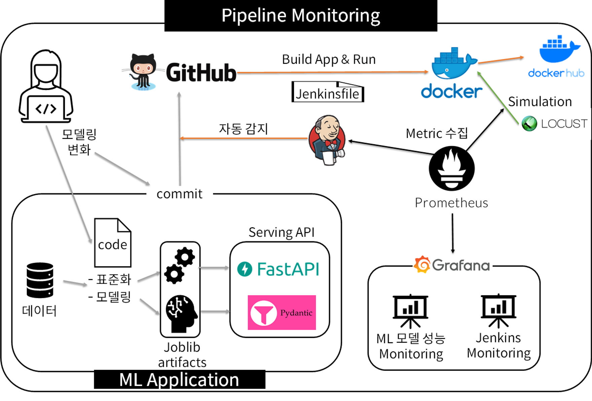
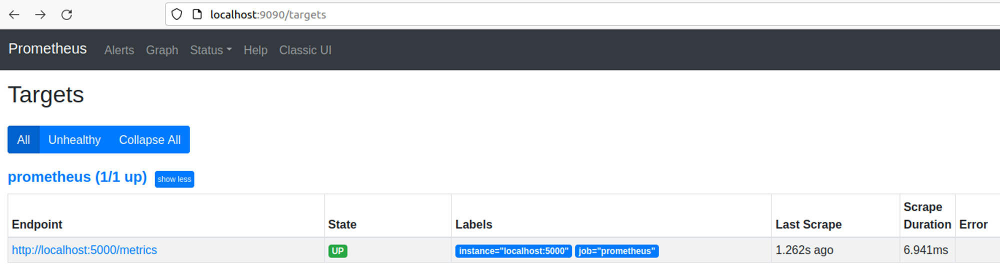
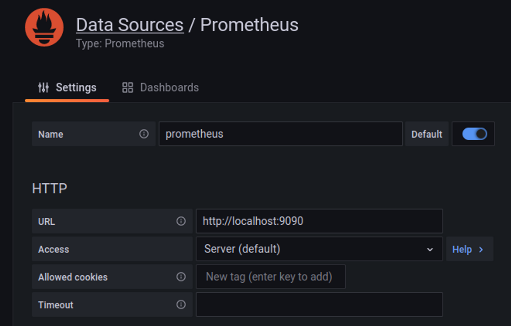

# Pipeline Monitoring

## Pipeline Monitoring Architecture


1. 데이터: [Red Wine Quality data](https://www.kaggle.com/datasets/uciml/red-wine-quality-cortez-et-al-2009)
2. code: 표준화 하는 코드와 모델링 하는 코드가 있음. 
3. Joblib artifacts: 표준화 code를 실행 하면 scaler 가 나오고, 모델링 code를 실행하면 모델 파일이 나온다. 이 둘을 [Joblib artifacts](https://joblib.readthedocs.io/en/latest/) 형식으로 저장. 
4. Serving API: Fast API와 Pydantic을 사용해서 Serving API를 구현함.  (Pydantic: pydantic : Type annotations 을 사용해 데이터 구문 분석 및 유효성 검사를 자동으로 해주고 오류 시 error 를 반환해주는 유용한 라이브러리)
5. Github에 push
6. Jenkins: Build App and Run. 이때 Build된 docker image를 Docker hub에 push
7. Container를 실행하고 
8. Locust: 생성된 docker container에서 실행되고 있는 App을 테스트 
9. Prometheus: Jenkins의 동작의 metric을 수집, Locust가 App을 실행할 때의 metrics을 수집. 
10. Grafana: Jenkins에서 수집한 metric은 Jenkins monitoring dashboard에, Locust에서 실행된 App의 metric을 ML 모델 성능 Monitoring dashboard에 표현해줌. 

-> 결과적으로 Jenkins monitoring 과 ML 모델 성능 Monitoring이 있는데 ML 모델 성능 Monitoring에 대해서 실습을 진행해본다. 

## 실습 주제
### Prerequisite
1. Data 준비. [Red Wine Quality data](https://www.kaggle.com/datasets/uciml/red-wine-quality-cortez-et-al-2009)에서 csv download
2. train.py 에 간단한 모델 훈련 코드 생성
3. 실행하여 모델 joblib artifact, scaler joblib artifact 생성
```bash
python3 -m venv venv && source ./venv/bin/activate 

pip install -r requirements.txt 

python train.py

# result
# INFO:__main__:Preparing dataset...
# INFO:__main__:Training model...
# INFO:__main__:Test MSE: 0.35108395857445623
# INFO:__main__:Saving artifacts...
```

### 실습 1. ML 모델 성능 Monitoring
1. FastAPI Serving API 생성
    - schemas.py: Data Validation 을 위한 [pydantic schema](https://pydantic-docs.helpmanual.io/usage/schema/) 작성
    - app.py: 패키지, scaler, model 로드, 기본 api 생성
    - 실행을 위해 Dockerfile, docker-compose file 작성. 
2. FastAPI Serving API(ML Serving App) 실행
```bash
docker-compose up

# Go localhost:5000
```
3. FastAPI-Prometheus Metric 수집
    - FastAPI와 Prometheus을 연결하는 [prometheus_fastapi_instrumentator](https://github.com/trallnag/prometheus-fastapi-instrumentator) 사용
    - [Metric 유형 참고 사이트](https://promlabs.com/blog/2020/09/25/metric-types-in-prometheus-and-promql)  [from PromLabs]
    - bucket : 개발자가 임의로 지정해 둔 측정 범위를 의미 (ex. 3분에 한 번 측정할래. 하면 이 3분 이라는 측정 범위가 bucket이 됨. )
    - Histogram : bucket 안에 있는 metric 의 빈도 측정
    - api 에 연동 부분 추가
        ```python
        from .monitoring import instrumentator
        ...
        instrumentator.instrument(app).expose(app, include_in_schema=False, should_gzip=True)
        ```
4. Prometheus 와 Grafana 연동
- prometheus 로컬 설치
    - prometheus.yml 작성 ([참고](https://prometheus.io/docs/prometheus/latest/configuration/configuration/))
        - global.scrape_interval : 몇 초마다 Metric 을 수집할 지 설정
        - global.evaluation_interval : AlertRule 을 어느 주기마다 evaluate 할 것인지 설정
            - evaluate 하게 되면 inactive, pending, firing 의 3가지 state 로 구분이 되고, 이를 기반으로 alertmanager에서의 알람 발송 여부를 정할 수 있다.
            - alertmanager의 rule은 expression을 사용해서 설정할 수 있다.
        - scrape_config
            - job_name : 메트릭을 수집해서 구분을 할 네이밍을 지정
            - static_configs.targets : Metric 을 수집할 서버 주소를 지정한다.
        
        ```yaml
        # prometheus.yml
        
        global:
          scrape_interval:     15s
          evaluation_interval: 30s
          # scrape_timeout is set to the global default (10s).
        
        scrape_configs:
        - job_name: fastapi
          honor_labels: true
          static_configs:
          - targets:
            - localhost:5000  # metrics from model
        ```
        
    - prometheus.yml 을 volume 으로 참조해서 실행
        - `docker run -d --name prom-docker --network=host -v <서버 경로>/prometheus.yml:/etc/prometheus/prometheus.yml prom/prometheus`
        
    - [localhost:9090/targets](http://localhost:9090/targets) 에 접속하여 확인
        
        
        
    - grafana 로컬 설치/ prometheus metric 연결 확인
        - `docker run -d --name grafana-docker --network=host grafana/grafana`
        - 여기선 다 prometheus, grafana 같이 띄우도록 `sh run.sh`
        - [localhost:3000](http://localhost:3000) 접속
            - 초기 아이디/비밀번호 : admin/admin
        - prometheus 연결 확인
            - [Configuration]-[Data sources]-[Add data source]-[Prometheus 선택]
                
                
                
            - Save & test 확인
            - Explore
            - New Panel
                - Data source : Prometheus
                - Metrics browser : fastapi_monitoring_regression_model_output_sum{}
                - Use Query
5. Locust를 이용한 Simulation 및 Dashboard 생성
    - [Locust](http://docs.locust.io/en/stable/what-is-locust.html) 란?
        - 구축된 서버의 성능을 측정하기 위한 stress test 도구
        - 특징
            - @task 데코레이터의 인자값을 이용해 어느 task 를 더 많이 실행할 지 정의
    - 코드 작성
        - locust 폴더, locustfile.py 생성
        - Feature 와 dataset 정의
        - test class 생성
    - 로컬에서 locust 실행
        - sh run_test.sh\
    - localhost:8089 접속하여 확인
### 실습 2. Jenkins 를 이용한 ML 모델 업데이트 및 자동 배포
### 실습 3. Jenkins Monitoring

을 진행해 볼 것임. 

각각의 실습마다 별도의 markdown 정리와 example code, config file 들이 생성 될 것이며 링크를 첨부할 예정. 
